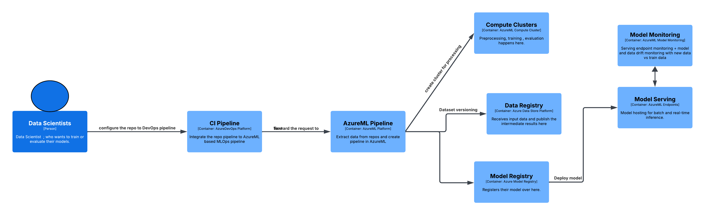

# Azure-MLOps-Pipeline
Centralized MLOps Pipeline for the Azure ML Platform 

This repository contains a centralized Azure Machine Learning (AzureML) pipeline for training, evaluation, and optional preprocessing/visualization of models across feature repositories. It automates:

- Downloading feature repos
- Reading environment and configuration files
- Mounting datasets from Azure Datastores
- Executing preprocessing, training, and evaluation steps
- Publishing and submitting the pipeline to AzureML

The pipeline is modular, allowing you to enable or disable steps depending on your workflow.

# Architecture / Workflow



## High-level Architecture:
### 1. Source Control & CI/CD
- **Git Repositories**: Feature repos are version-controlled in Git.
- **Azure DevOps Pipeline (YAML)**: Parameterized CI/CD pipeline triggers on commits to `main`.
- **Automation**: Submits jobs to AzureML using templates and parameters.

### 2. Pipeline Orchestration
- **Entrypoint (`build_aml_pipeline.py`)**: Dynamically builds AzureML pipelines.
- **Steps (`get_step`)**: Encapsulates preprocessing, training, evaluation as `PythonScriptStep`s.
- **Publishing**: Pipelines are versioned and published to the AzureML workspace.

### 3. Compute & Execution
- **AML GPU Cluster**: Heavy training workloads.
- **AML CPU Cluster**: Preprocessing and evaluation tasks.
- **RunConfigurations**: Define environments, dependencies, and execution context.

### 4. Data Layer
- **Azure Datastores**: Centralized storage for raw inputs, intermediate outputs, and results.
- **Datasets**: Mounted into compute targets via `DatasetConsumptionConfig`.
- **PipelineData**: Passes intermediate results between steps.

### 5. Model Lifecycle
- **Training Output**: Produces model artifacts.
- **Evaluation Output**: Generates metrics and validation results.
- **Model Registry**: Models can be registered for deployment.
- **Endpoints**: Published pipelines expose endpoints for reuse.

### 6. Monitoring & Logging
- **Centralized Logging**: Captures step creation, compute targets, datastore mounts, and pipeline publishing.
- **AzureML Studio**: Provides dashboards for monitoring runs, metrics, and artifacts.

---

# Features
- **Dynamic repo download**: Pulls feature repos directly from Git URLs.
- **Config-driven execution**: Reads `.env` and config files for environment setup.
- **Data integration**: Mounts datasets from Azure Datastores into compute targets.
- **Pipeline steps**: Preprocessing, training, evaluation, and visualization.
- **Publishing**: Automatically publishes the pipeline with versioning and description.
- **Logging**: Centralized logging for debugging and monitoring.

---

# Usage

### 1. Prerequisites
- Python 3.10
- Azure CLI (`az`)
- AzureML SDK (`azureml-core`, `azureml-pipeline`)
- Access to an AzureML workspace with compute clusters defined

### 2. Environment Variables
Set the following environment variables (or provide via `.env`):
- `TENANT_ID`
- `AML_GPU_CLUSTER_NAME`
- `AML_CPU_CLUSTER_NAME`
- `INTERMEDIATE_DATASTORE_NAME`

In your config file (`train_config.ini`), under `[MLOPS]`:
- `data_store_name`
- `path_on_datastore`
- `mount_path`
- `training_output`
- `evaluation_output`

### 3. Run the Pipeline
```bash
python build_aml_pipeline.py \
  --ml_config_module configs/train_config.ini \
  --env_relative_filepath configs/.env.gpu_cluster \
  --feature_repo_url git+https://<ACCESS_TOKEN>@<REPO_URL>@<BRANCH>#egg=<PACKAGE_NAME> \
  --model_id mymodel:1 \
  --description "Training and evaluation pipeline" \
  --run_preprocessing True \
  --run_training True \
  --run_evaluation True \
  --run_visualizer False
```
```python
# Example
python -m mlops_service.build_pipeline --feature_repo_url git+https://github_pat@github.com/gautampawnesh/Multimodal-Biometric-Recognition-System@main#egg=biometric-recognition --env_relative_filepath biometric-recognition/configs/.env.azureml_config  --ml_config_module biometric-recognition/configs/experiment1.config --run_training True --run_preprocessing True
```
# CI Pipeline [Not Tested]

This pipeline can automates the continuous integration and delivery of ML workflows. Instead of manually running build_aml_pipeline.py, the CI pipeline:

- Accepts parameters (repo URL, config, env file, model ID, etc.)
- Triggers automatically on changes to main
- Spins up an Ubuntu agent
- Submits jobs to AzureML using a reusable job template (jobs.ml-pipeline.yml)

This ensures reproducibility, traceability, and automation of your ML lifecycle.

# Future Work:
- Integrate with Model Registry
- Trigger deployment pipeline after the training.
- setup data and model drift logic to retrain the models.

# Example Feature Repo
- https://github.com/gautampawnesh/Multimodal-Biometric-Recognition-System
